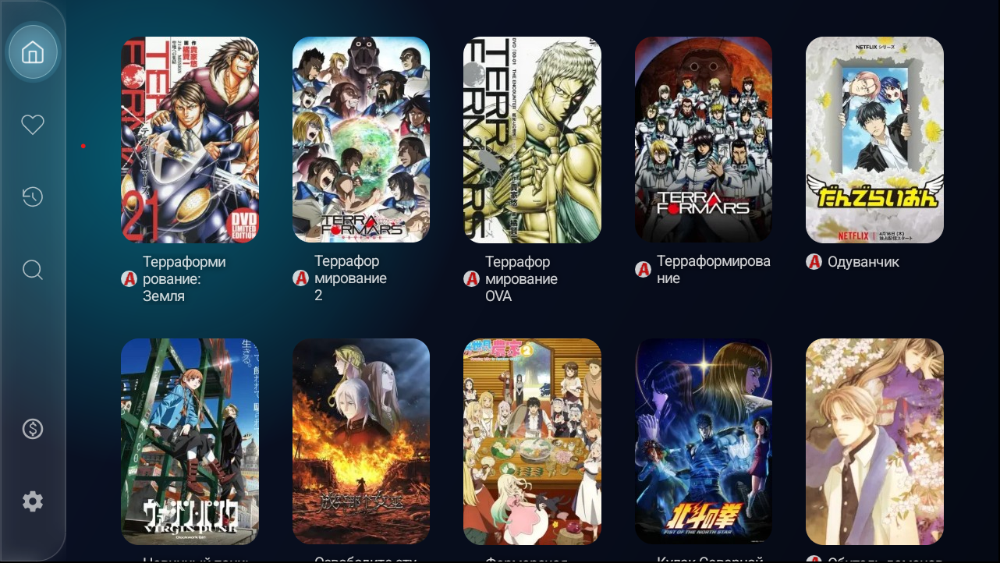
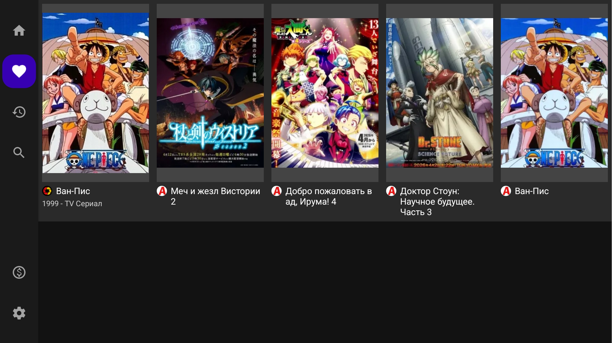
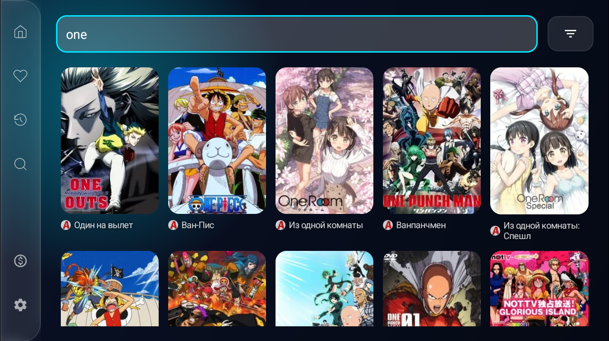
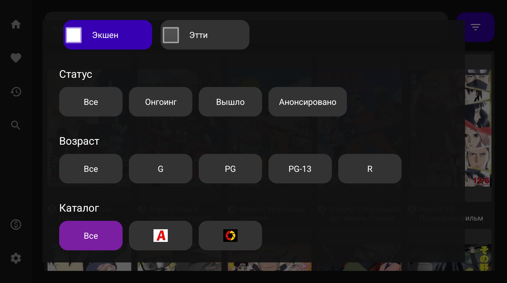
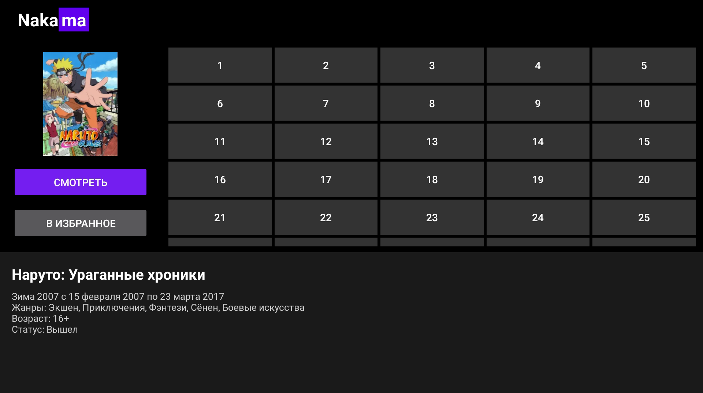
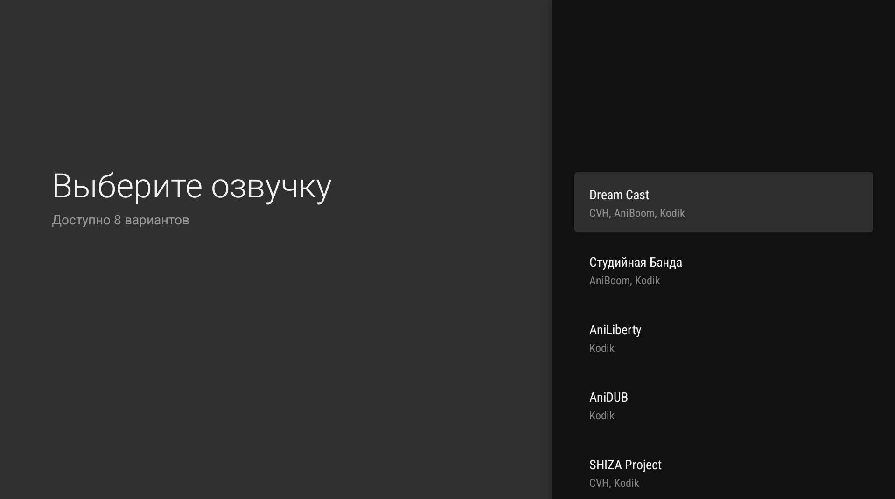
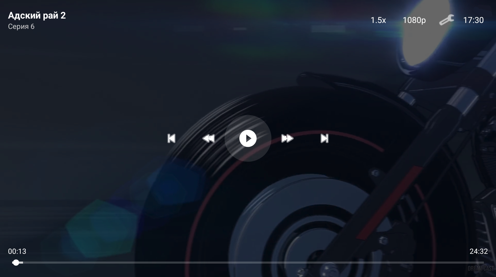

# Nakama

**Nakama** — это современное Android-приложение для просмотра аниме.
Проект ориентирован на удобство использования как на мобильных устройствах, так и на **Android TV**.

## 🚀 Основные возможности

- **Мультиплатформенность:** Поддержка каталогов аниме.
- **Android TV:** Оптимизированный интерфейс для телевизоров с поддержкой пультов ДУ.
- **Встроенный плеер:** Поддержка форматов MP4, HLS и DASH через ExoPlayer.
- **Избранное и история:** Сохранение прогресса просмотра и списка любимых тайтлов.
- **Deep Search:** Продвинутый поиск по всем доступным каталогам.

## 🛠 Технологический стек

- **Архитектура:** MVVM, Clean Architecture (модули `app`, `domain`, `data`, `source-api`).
- **Инъекция зависимостей:** [Hilt](https://dagger.dev/hilt/)
- **Загрузка изображений:** [Glide](https://github.com/bumptech/glide)
- **Плеер:** [Media3 / ExoPlayer](https://developer.android.com/guide/topics/media/exoplayer)
- **Реактивное программирование:** [RxJava 3](https://github.com/ReactiveX/RxJava) и Coroutines.
- **UI:** XML Layouts, [Leanback](https://developer.android.com/jetpack/androidx/releases/leanback) для Android TV.

## ⚙️ Требования

Проект использует Gradle (Kotlin DSL). 

- **minSdk:** 21 (Android 5.0)
- **targetSdk:** 35 (Android 15)

